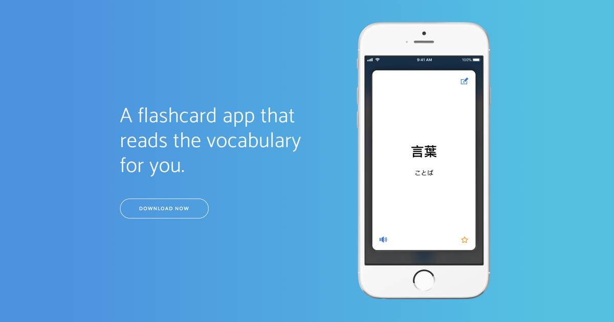

# Kotoba Flashcards

A flashcard app that reads the vocabulary for you.

## Features

With Kotoba flashcards you can:

- Go through the cards using intuitive gestures
- Easily add new vocabulary, flip and edit the cards for note taking
- Automatically generate Hiragana as you type in Japanese
- Choose from supported voices in English, French, German, Indonesian, Japanese, Korean, Mandarin, Spanish, Swedish, and Thai

No signup or login required. Just listen to the words you are learning.

Find out more at <https://kotoba.app>

## Download

## Feedback

Your feedback is always welcome!

Please create a [GitHub Issue](https://github.com/bcylin/KotobaFlashcards/issues/new) for feature discussions, bug reports and anything about Kotoba Flashcards.

## About

Kotoba Flashcards is created by [@bcylin](https://bcyl.in).

Copyright © 2018-2021 bcylin. All Rights Reserved.
